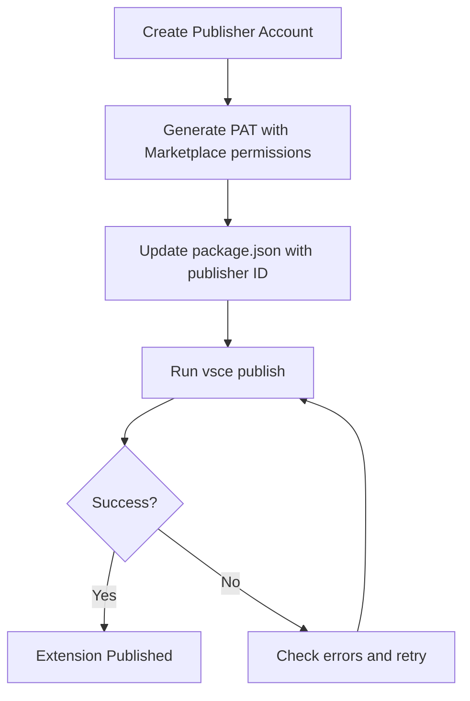

# Publisher Setup Guide

This guide explains how to set up a publisher account for VS Code Marketplace and resolve common publishing issues.

## Step 1: Create Publisher Account

Since the `vsce create-publisher` command is no longer available, you must create the publisher through the web interface:

1. **Go to VS Code Marketplace Management**
   - Visit: https://marketplace.visualstudio.com/manage
   - Sign in with your Azure DevOps account

2. **Create New Publisher**
   - Click "Create new publisher" or "New Publisher"
   - Fill in the publisher details:
     - **Publisher ID**: `zameerkh2932` (must match package.json)
     - **Display Name**: Your preferred display name
     - **Description**: Brief description of your extensions
   - Click "Create"

## Step 2: Verify Publisher Setup

After creating the publisher:

1. **Check Publisher List**
   ```bash
   vsce ls-publishers
   ```

2. **Login to Publisher**
   ```bash
   vsce login zameerkh2932
   # Enter your Personal Access Token when prompted
   ```

## Step 3: Update Personal Access Token Permissions

Ensure your PAT has the correct permissions:

1. Go to Azure DevOps: https://dev.azure.com
2. Click on your profile → Security → Personal Access Tokens
3. Edit your existing token or create new one with:
   - **Scopes**: Custom defined
   - **Marketplace**: Manage (Read, write, & manage)
   - **Expiration**: Set appropriate expiration date

## Step 4: Publish Extension

Once the publisher is set up:

```bash
# Method 1: Direct publish
vsce publish --pat YOUR_PERSONAL_ACCESS_TOKEN

# Method 2: Login then publish  
vsce login zameerkh2932
vsce publish

# Method 3: Use our PowerShell script
$env:VSCE_PAT = "YOUR_PERSONAL_ACCESS_TOKEN"
.\publish.ps1 -Force
```

## Current Status & Next Steps

✅ **Completed:**
- Extension developed and tested
- Code cleaned and production-ready
- Package created successfully: `prompt-vault-1.0.0.vsix`
- Extension installed locally for testing

⚠️ **Pending:**
- Publisher account creation: https://marketplace.visualstudio.com/manage
- Publisher ID `zameerkh2932` needs to be created through web interface

🚀 **Manual Publishing Option:**
Until the publisher account is set up, you can distribute the extension manually:
1. Share the `prompt-vault-1.0.0.vsix` file
2. Users install with: `code --install-extension prompt-vault-1.0.0.vsix`

## Troubleshooting

### 401 Unauthorized Error
- Verify publisher exists: https://marketplace.visualstudio.com/manage
- Check PAT permissions include "Marketplace (Manage)"
- Ensure publisher ID in package.json matches created publisher

### PAT Issues  
- Create new PAT with Marketplace permissions
- Verify PAT hasn't expired
- Use custom scope, not full access

### Publishing Workflow


## Alternative: GitHub Releases

While setting up marketplace publishing, you can also use GitHub releases:

1. **Create GitHub Release**
   ```bash
   git tag v1.0.0
   git push origin v1.0.0
   ```

2. **Upload VSIX to Release**
   - Go to your GitHub repository
   - Create new release with tag v1.0.0  
   - Upload `prompt-vault-1.0.0.vsix` as release asset

3. **Installation Instructions for Users**
   ```bash
   # Download .vsix from GitHub releases
   # Install with:
   code --install-extension prompt-vault-1.0.0.vsix
   ```

This provides an immediate distribution method while marketplace publishing is being set up.
